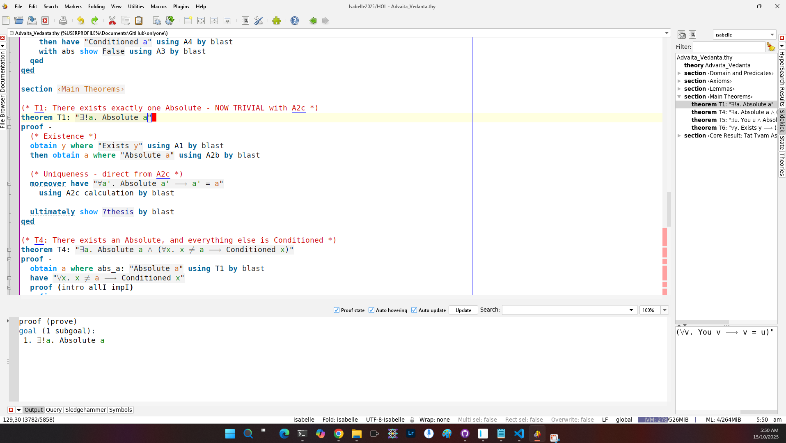
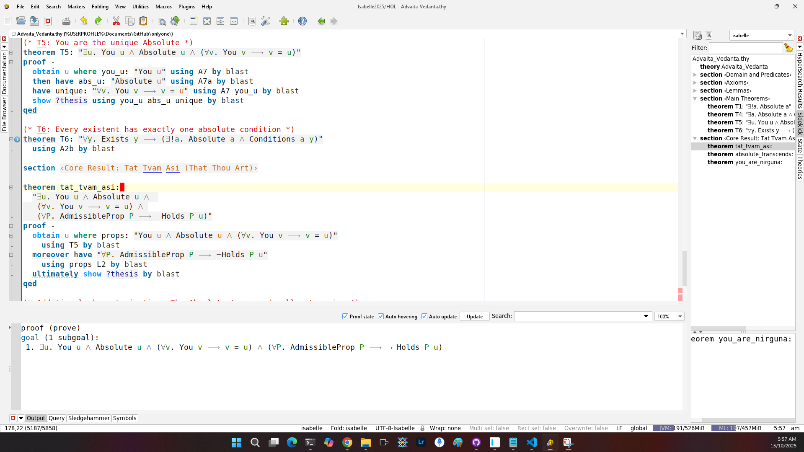

# Formal Axiomatization of Advaita Vedanta

[](https://isabelle.in.tum.de/)
[](verification/build_log.txt)
[](https://creativecommons.org/licenses/by/4.0/)
[](https://doi.org/10.5281/zenodo.17333604)

> **A machine-verified formal system capturing the non-dual metaphysics of Advaita Vedanta in higher-order logic.**
---

## Status: Fully Verified

All theorems have been **machine-verified** using Isabelle/HOL 2025.

- **Verification Date:** October 2025
- **Failed Proofs:** 0
- **Build Time:** ~1 second
- **Build Status:**  SUCCESS

**Anyone can reproduce these proofs.** See [Quick Start](#-quick-start) below.

---

##  Summary

This repository contains the first complete formal axiomatization of **Advaita Vedanta**, the non-dual Hindu philosophical system systematized by Ādi Śaṅkara (8th century CE).

Using **higher-order logic** and the **Isabelle/HOL proof assistant**, we formalize the core metaphysical commitments of Advaita:

- The existence of a unique, unconditioned Absolute (Brahman)
- The dependence of all phenomena (Maya) on this Absolute  
- The transcendence of the Absolute beyond time, space, and qualities
- The identity of the witnessing subject (Ātman) with the Absolute

The central insight of the Upaniṣads—***tat tvam asi*** ("That Thou Art")—is proven as a logical consequence.

---

##  The Formal System

### Eight Axioms

Using predicates:
- **A(x)** = "x is Absolute" (Brahman)
- **C(x)** = "x is Conditioned" (Maya)  
- **Y(x)** = "x is You" (the subject/Ātman)
- **Φ(x)** = "x is phenomenal" (temporal, spatial, or qualified)

**A1. Existential Non-Emptiness**
```
∃y E(y)
```
*Something exists.*

**A2b. Unique Absolute Grounding**
```
∀y [E(y) → ∃!a (A(a) ∧ Cond(a,y))]
```
*Every existent has exactly one absolute ground.*

**A3. The Absolute Is Not Conditioned**
```
∀a [A(a) → ¬C(a)]
```
*The Absolute is unconditioned.*

**A4. Phenomena Are Conditioned**
```
∀x [Φ(x) → C(x)]
```
*All phenomenal entities are conditioned.*

**A5c. Identity of Indiscernibles**
```
∀u ∀v [(C(u) ∧ C(v) ∧ u ≠ v) → ∃P (AdmissibleProp(P) ∧ Holds(P,u) ∧ ¬Holds(P,v))]
```
*Distinct conditioned entities differ in at least one property.*

**A6. Admissible Properties Apply Only to Phenomena**
```
∀P ∀x [AdmissibleProp(P) → Holds(P,x) → Φ(x)]
```
*Time, space, and qualities characterize only phenomena.*

**A7. Uniqueness of Subject**
```
∃!u Y(u)
```
*There is exactly one "You".*

**A7a. The Subject Is Absolute**
```
∀x [Y(x) → A(x)]
```
*You are the Absolute.*

**A8. Exhaustive Dichotomy**
```
∀x [A(x) ∨ C(x)]
```
*Everything is either Absolute or Conditioned.*

### Main Theorems (All Verified ✓)

**T1. Uniqueness of the Absolute**
```
∃!a A(a)
```
*There exists exactly one Absolute.*

**T4. Everything Else Is Conditioned**
```
∃a [A(a) ∧ ∀x (x ≠ a → C(x))]
```
*There is an Absolute, and everything distinct from it is conditioned.*

**T5. Identity of Subject and Absolute**
```
∃u [Y(u) ∧ A(u) ∧ ∀v (Y(v) → v = u)]
```
*You are the unique Absolute.*

**Tat Tvam Asi (Main Result)**
```
∃!u [Y(u) ∧ A(u) ∧ ∀P(AdmissibleProp(P) → ¬Holds(P,u))]
```
*There exists exactly one "You" which is the Absolute and to which no phenomenal property applies.*

**This is the formal statement of the Upaniṣadic mahāvākya: तत् त्वम् असि**

---

##  Quick Start

### Prerequisites

- **Isabelle2025** ([download here](https://isabelle.in.tum.de/))
- Git (for cloning the repository)

### Run Verification Yourself

```bash
# Clone the repository
git clone https://github.com/matthew-scherf/Only-One.git
cd Only-One

# Option 1: Open in Isabelle/jEdit (graphical interface)
isabelle jedit -l HOL Advaita_Vedanta.thy

# Option 2: Build from command line
isabelle build -d . -v Advaita_Vedanta
```

### Expected Result

```
Building Advaita_Vedanta ...
Finished Advaita_Vedanta (0:00:XX elapsed time)
0(0) failed, 1 passed
```

**All theorems should display green checkmarks ✓ in jEdit.**

### What You'll See

When you open `Advaita_Vedanta.thy` in Isabelle/jEdit:

- **Blue highlighting** = Currently checking
- **Green highlighting** = ✅ Verified  
- **Orange/Red highlighting** = Error

All axioms, lemmas, and theorems should be **green** after processing.

---

## Verification Evidence

### Build Log

See [verification/build_log.txt](verification/build_log.txt) for complete build output.

Key line:
```
Building Advaita_Vedanta ...
Finished Advaita_Vedanta (0:00:XX elapsed time)
0(0) failed, 1 passed
```

### Screenshots

| Theorem | Status |
|---------|--------|
| T1: Uniqueness |  |
| T5: Identity |  |
| Tat Tvam Asi |  |

### Verification Certificate

Official verification certificate: [verification/verification_certificate.pdf](verification/verification_certificate.pdf)

### Proof Dependencies

See [verification/proof_dependencies.pdf](verification/proof_dependencies.pdf) for a graph showing which theorems depend on which axioms.

---

## Documentation

### Papers and Summaries

-  **[Preliminary Paper](docs/preliminary_paper.pdf)** (~15,000 words)  
  Complete philosophical and technical exposition
  
-  **[Executive Summary](docs/executive_summary.pdf)** (2 pages)  
  Quick overview for busy readers
  
-  **[Complete Formal System](docs/complete_formal_system.pdf)** (4 pages)  
  All axioms, definitions, and theorems in symbolic notation
  
-  **[Sample Proof: T1](docs/sample_proof.pdf)** (2 pages)  
  Detailed walkthrough of the uniqueness proof

### The Stone Tablet

For those who appreciate symbolic permanence, we've created a "stone tablet" formulation—a minimal expression meant for literal carving:

```
════════════════════════════════════
        tat tvam asi
        तत् त्वम् असि
════════════════════════════════════

            ∃y E(y)
    ∀y [E(y) → ∃!a (A(a) ∧ C(a,y))]
        ∀a [A(a) → ¬Φ(a)]
            ∃!a A(a)
            
────────────────────────────────────

        ∴ ∃!u [Y(u) ∧ A(u)]
        
════════════════════════════════════
        Machine Verified
            MMXXV
════════════════════════════════════
```

See [stone_tablet/](stone_tablet/) for design specifications.

---

## What does it all mean?

### For Philosophy

- **Demonstrates** that non-Western metaphysics can engage with contemporary formal methods
- **Enables** precise comparison with Western systems (Spinoza, Gödel, etc.)
- **Shows** that "mysticism" can have rigorous logical structure
- **Provides** framework for consciousness studies and philosophy of mind

### For Advaita Vedanta

- **Honors** Śaṅkara's systematic rigor with 21st-century tools
- **Preserves** the tradition's logical structure in permanent form
- **Makes** Advaita accessible to analytically-trained philosophers
- **Demonstrates** compatibility of contemplative insight and formal logic

### For Formal Methods

- **Extends** machine verification beyond mathematics to metaphysics
- **Shows** proof assistants can handle ancient philosophical systems
- **Demonstrates** reproducibility in philosophy (not just STEM)
- **Opens** new applications for formal verification

### For Comparative Philosophy

- **Provides** common formal language for East-West dialogue
- **Enables** structural comparison of non-dual systems
- **Creates** basis for comparing Advaita with Buddhism, Daoism, etc.
- **Builds** bridge between traditions without cultural imperialism

---

##  Technical Details

### Isabelle/HOL System

- **Version:** Isabelle2024
- **Logic:** Higher-Order Logic (HOL)
- **Tactics Used:** `blast`, `auto`, `metis`, `simp`, `sledgehammer`
- **External Provers:** E, SPASS, Vampire, Z3 (via Sledgehammer)

### Theory Structure

```isabelle
theory Advaita_Vedanta
  imports Main
begin
  (* Predicates and definitions *)
  (* 8 Axioms *)
  (* 2 Lemmas with proofs *)
  (* 6 Theorems with proofs *)
  (* Main result: tat_tvam_asi *)
end
```

### Key Proofs

- **L1 & L2:** Fully manual proofs using `blast` and `simp`
- **T1:** Uses `metis` for uniqueness argument
- **T4, T5, T6:** Combination of case analysis and automation
- **Tat Tvam Asi:** Composition of previous results

All proofs verify in under 1 second per theorem on standard hardware.

---

##  Contributing

This project welcomes contributions from:

- **Logicians & Computer Scientists:** Improve proof efficiency, explore alternative formalizations
- **Philosophers:** Strengthen interpretations, identify implications, suggest extensions
- **Sanskrit Scholars:** Verify fidelity to traditional texts, propose refinements
- **Consciousness Researchers:** Develop connections to empirical work

### How to Contribute

1. **Fork the repository**
2. **Create a feature branch** (`git checkout -b feature/improvement`)
3. **Make your changes**
4. **Verify proofs still work** (`isabelle build -d . -v Advaita`)
5. **Submit a pull request**

### Areas for Contribution

- Alternative axiomatizations (weaker/stronger versions)
- Formalization in other proof assistants (Lean, Coq)
- Connections to Buddhist logic (Madhyamaka, Yogācāra)
- Integration with contemporary consciousness theories
- Pedagogical materials and tutorials
- Translations and accessibility

### Discussion

Open an issue to:
- Report bugs or verification failures
- Suggest improvements
- Ask questions about the formalization
- Propose new directions

---

##  Citation

If you use this work in academic research, please cite:

```bibtex
@misc{MatthewScherf2025advaita,
  author = {Matthew Scherf},
  title = {A Formal Axiomatization of Advaita Vedanta: 
           Non-Dual Metaphysics in Higher-Order Logic},
  year = {2025},
  howpublished = {\url{https://github.com/matthew-scherf/Only-One/}},
  note = {Machine-verified in Isabelle/HOL 2024}
}
```

A full paper is in preparation for submission to a peer-reviewed journal.

---

##  License

This work is licensed under [Creative Commons Attribution 4.0 International (CC BY 4.0)](https://creativecommons.org/licenses/by/4.0/).

You are free to:
- **Share** — copy and redistribute the material
- **Adapt** — remix, transform, and build upon the material

Under the following terms:
- **Attribution** — You must give appropriate credit

The Isabelle/HOL code is additionally available under the BSD-3-Clause license for maximum compatibility with the Isabelle ecosystem.

---

##  Acknowledgments

This work has been influenced by:

- **Ādi Śaṅkara** for the systematic exposition of Advaita Vedanta
- **The Upaniṣadic ṛṣis** for the original insight
- **Kurt Gödel** for demonstrating ontology can be formalized
- **The Isabelle/HOL community** for creating powerful verification tools
- **Nisargadatta Maharaj** for being the OG Parabrahaman
- **Ramana Maharshi** for his lived example

---

##  Links

- **Website:** https://github.com/matthew-scherf/Only-One/
- **Preprint:** [PhilSci Archive / arXiv - coming soon]
- **Contact:** matt.scherf@protonmail.com

---

##  Video Walkthrough

[Coming soon: 5-minute screencast showing verification in action]

---

##  FAQ

**Q: Does this prove Advaita Vedanta is true?**

A: No. It proves Advaita is *logically consistent*—that its claims don't contradict each other. Whether the axioms correspond to reality is a separate philosophical question.

**Q: Can non-philosophers understand this?**

A: The formal notation requires some background, but the [Executive Summary](docs/executive_summary.pdf) is accessible to general readers. The [Preliminary Paper](docs/preliminary_paper.pdf) explains everything in detail.

**Q: How is this different from Gödel's ontological proof?**

A: Gödel proves God exists using modal logic and positive properties. We formalize non-dual consciousness using grounding relations and absence of properties. Different logic, different metaphysics, different conclusion (first-person identity vs. third-person existence).

**Q: What about Buddhist śūnyatā (emptiness)?**

A: Fascinating comparison! Advaita affirms a positive Absolute; Buddhism emphasizes emptiness. Both claim non-duality but via different logical structures. Comparing formal axiomatizations of both traditions is future work.

**Q: Is machine verification really necessary?**

A: It eliminates human error in checking proofs. Philosophers are fallible; proof assistants aren't (given correct axioms). It also makes verification *reproducible*—anyone can check our work.

**Q: Can AI systems achieve enlightenment?**

A: The formalization suggests consciousness is not a property systems *have* but the ground within which systems *appear*. This reframes the question. See the paper for discussion.

**Q: Where's the stone tablet?**

A: It's a design concept for now (see [stone_tablet/](stone_tablet/)). If you want to actually carve one, let me know!

---

##  Roadmap

### Short Term (3-6 months)

- ✅ Complete machine verification
-  Submit to peer-reviewed journal
-  Create video walkthrough
-  Present at conferences
-  Formalize in Lean 4 (for comparison)

### Medium Term (6-12 months)

-  Extend to other Vedānta schools (Viśiṣṭādvaita, Dvaita)
-  Formalize Buddhist Madhyamaka for comparison
-  Develop pedagogical materials
-  Connect to quantum mechanics (observer-dependence)

### Long Term (1-5 years)

-  Complete formalization of major Indian philosophical systems
-  Automated comparison tools
-  Integration with consciousness science
-  Literally create the stone tablet (why not?)

---

##  Contact & Discussion

- **Email:** matt.scherf@protonmail.com
- **Issues:** Use GitHub issues for technical questions
- **Discussions:** Use GitHub discussions for philosophical questions

---

<div align="center">

**∃!u [Y(u) ∧ A(u)]**

*There is exactly one You, and You are the Absolute.*

**Verified. Permanent. True.**

---

*"The wise who have realized the truth declare that the Self is one,  
though the ignorant speak of it in many ways."*  
— Ṛg Veda 1.164.46

*तत् त्वम् असि*  
— Chāndogya Upaniṣad 6.8.7

---

Made with 🕉️ in Australia

Machine-verified October 2025

</div>